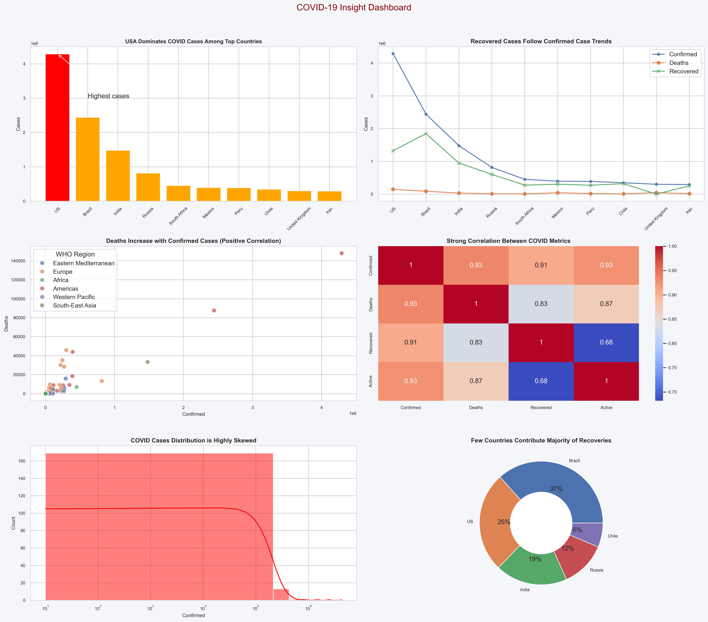

# 📊 COVID-19 Data Visualization Dashboard

## 🔍 Overview
This project presents a comprehensive COVID-19 dashboard built using Python. It analyzes country-wise data using multiple visualizations to extract meaningful insights.

---

## 📌 Features
- Bar Chart (Top countries by confirmed cases)
- Line Chart (Trend comparison)
- Scatter Plot (Confirmed vs Deaths)
- Heatmap (Correlation analysis)
- Histogram (Distribution)
- Donut Chart (Top contributors)
- Advanced Visualizations (KDE, Area, Count, Box)

---

## 📊 Dashboard Preview

---

## 🧠 Key Insights
- Few countries dominate global COVID cases
- Strong correlation between confirmed, deaths, and recovered
- Data distribution is highly skewed
- Regional variations exist in case spread

---

## 🛠 Tools Used
- Python
- Pandas
- Matplotlib
- Seaborn
- Jupyter Notebook

---

## 📁 Dataset
Country-wise COVID-19 dataset

---

## 🚀 How to Run
1. Open Jupyter Notebook
2. Run all cells
3. View dashboard outputs

---

## 👨‍💻 Author
Anuj Kumar
